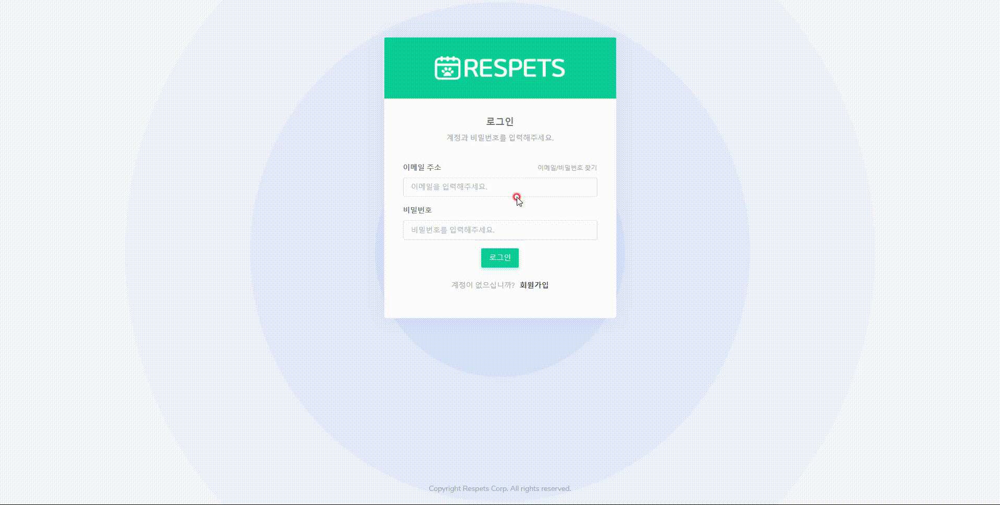
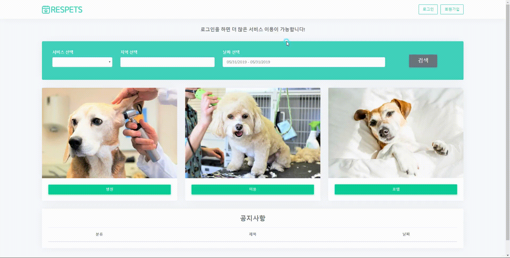
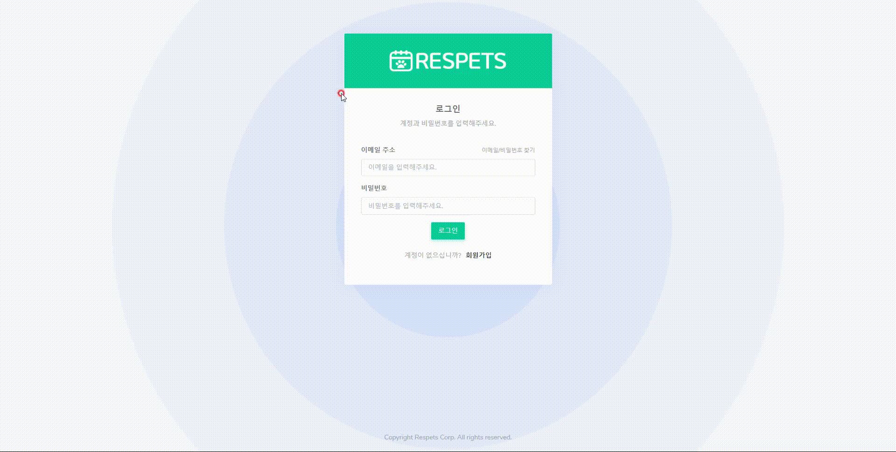
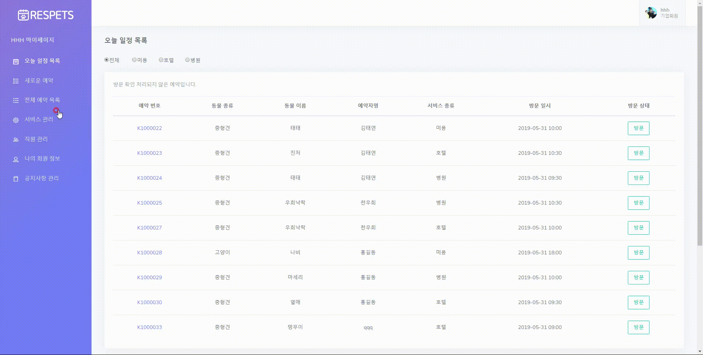
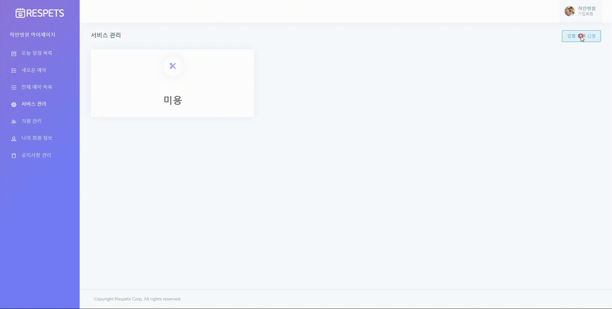
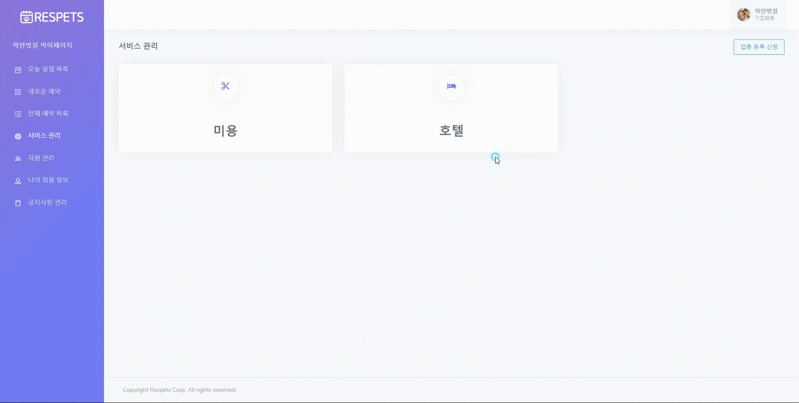

# Respets

반려동물을 키우는 인구가 증가하며 반려동물 관련 시장이 성장함에 따라 편리 서비스를 제공하는 웹 사이트의 부족함을 느껴 제작하게 되었습니다.

#### 환경설정

> 언어: JAVA 8
>
> 프레임워크: Spring 3.9.6
>
> 서버: Apache Tomcat 9.0
>
> 데이터베이스: Oracle 11g
>
> 형상관리: Git (Sourcetree)
>
> 기타기술: JavaScript (jQuery, Ajax) / Bootstrap
>
> 운영체제: Mac OS

#### 주요역할 및 담당

> 잡 프로세스 설계 및 관리
>
> 기업 리스트 페이지 
>
> 아이디 / 비밀번호 찾기 
>
> 기업 오늘 일정 목록
>
> 기업 전체 예약 목록 구현
>
> 기업 서비스 관리 구현
>
> 기업 직원 관리 구현

#### 프로젝트 규모

> ##### DB
>
> > 테이블: 34개 (총 Column 173개)
> >
> > 사용된 Query 204개
> >
> > 사용된 View 4개
>
> ##### Source
>
> > Controller Class 6개 (총 URL 121개)
> >
> > DTO (Data Transfer Object) Class 10개
> >
> > Service Class 6개
> >
> > DAO (Data Access Object) Class 5개
> >
> > Mapper Class 5개
> >
> > 기타 2개
> >
> > View (JSP File) 73개

#### *잡 프로세스 작성 및 관리* 

- 팀원들이 개발을 수월히 할 수 있도록 잡 리스트를 작성 후 프로세스의 가이드 라인을 작성.
- 공유와 소통을 위해 구글 스프레드로 실시간 수정 및 관리
- https://docs.google.com/spreadsheets/d/1k1e7HMvijl0EMi_3OwUy5NjBZAI83utw-PJ4PpM703s/edit?usp=sharing

#### *기업 리스트 페이지*

- 키워드 검색 기능
  - 키워드를 통해 이미 검색된 기업들을 좀 더 정확하게 검색할 수 있는 기능
  - 앞 페이지에서 넘어온 값을 사용하여 DB에서 리스트를 검색 후 해당 기업들이 가지고 있는 키워드가  태그로 구현
  - 리스트가 9건이 넘을 경우 페이지네이션 처리

<strong>업종 선택 후 보여진 리스트에서 페이징과 키워드 검색이 된 것을 보여준다.</strong>

#### 아이디 / 비밀번호 찾기

- 아이디 찾기
  - 회원가입 시 입력했던 기본 정보로 DB검색 후 아이디를 찾음, 이 때의 입력된 값들은 기본키이다.
- 비밀번호 찾기
  - 찾은 아이디(이메일)로 JavaMail을 통해 메일을 발송
  - 메일에는 비밀번호 변경 폼 주소와 난수가 함께 보내져 타인이 악용하지 못하도록 방지
  - 메일은 30분이 지나면 옳은 URL이라도 사용이 불가능
  

<<strong>아이디(email)을 찾은 후 해당 메일로 비밀번호 변경 폼 주소 보내기</strong>>

<<strong>받은 주소를 통해 비밀번호 변경</strong>>

<<strong>받은 메일이 30분이 지나면 해당 주소는 유효하지 않다.</strong>>

#### *기업 오늘 일정 목록*

- 오늘 예약된 리스트
  - 해당 기업의 오늘 예약된 목록을 보여줌
- 방문 상태
  - Ajax를 통해 방문, 취소를 구현하여 현황 파악을 도와줌

<<strong>오늘 예약된 리스트 / 방문 상태 확인</strong>>

#### *기업 전체 예약 목록*

- 전체 예약 리스트
  - 기업이 현재까지 받은 모든 예약 목록을 불러옴
  - 리스트 구현 시 예약 번호에 링크를 걸어두어 상세 정보를 불러올 때 사용되게 함
- 목록 검색
  - 보호자 이름과 업종을 통해 특정 회원의 예약 리스트를 검색
  - 리스트가 10건이 넘을 경우 페이지네이션 처리

<<strong>전체 예약 목록 / 페이징 / 예약자 검색</strong>>

#### *기업 서비스 관리*

- 사진 업로드 기능
  - 멀티 파일 업로드 기능을 이용해 사업장 사진들을 올릴 수 있도록 구현
- 가격등록
  - Ajax를 통해 페이지에서 선택된 서비스에 가격을 입력할 수 있는 폼 생성
- 가격수정
  - 수정 시, 이전에 작성된 값이 존재하며 해당 값을 가져와 보여줌
  - DB에 접근을 했다가 다시 돌아오기 때문에 Ajax는 동기화로 진행하며, 비동기화 될 시 DB에 갔다가 돌아오는 시간보다 페이지 로딩 시간이 빠르기 때문에 화면에는 undefiend 결과가 보ㅇ짐
- 서비스 삭제 기능
  - 연관된 DB 테이블에 on delete cascade를 설정하여 해당 업종을 삭제할 경우 관련된 모든 데이터가 삭제되도록 구현
  - 트랜잭션을 통해 하나의 데이터라도 잘못될 경우 모든 데이터가 Rollback 됨

<<strong>기업 서비스 등록</strong>>

<<strong>기업 서비스 가격 수정</strong>>

<<strong>기업 서비스 삭제</strong>>

#### *기업 직원 관리*

- 사진 업로드 기능
  - 멀티 파일 업로드 기능을 이용해 사업장 사진들을 올릴 수 있도록 구현
- 직원 등록
  - 등록 시 해당 업종의 업무시간, 점심시간, 휴무일 값을 가져와 가이드라인을 생성

<<strong>직원 등록 (업종의 휴무일은 변경 불가능)</strong>>

